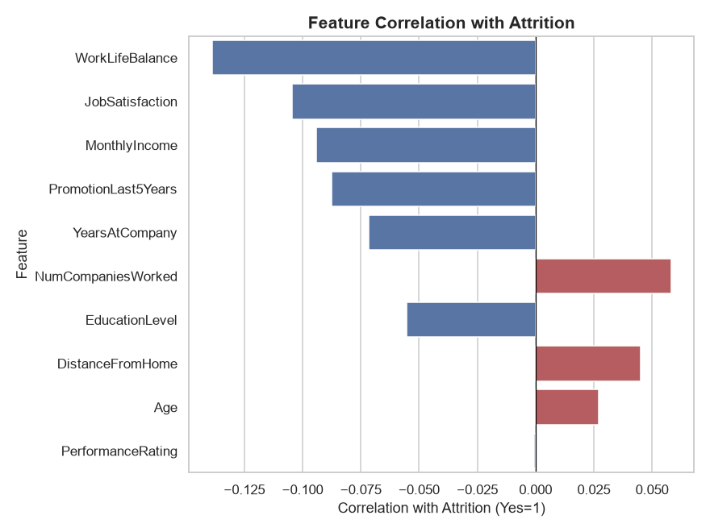

# 🔍 Exploratory Data Analysis (EDA) Project

An EDA project analyzing **HR employee attrition** — using statistical
summaries, distribution plots, correlation analysis, and group comparisons to
uncover *why* employees leave.



---

## 📌 Project Overview

| | |
|---|---|
| **Dataset** | 1,500 synthetic HR employee records |
| **Target of interest** | `Attrition` (Yes/No) — 25.5% attrition rate |
| **Goal** | Identify patterns, correlations, and key factors driving attrition |

## 🎯 What This Project Does

- **Statistical summaries** — `.describe()`, value counts, group-by breakdowns.
- **Univariate analysis** — distributions of age, income, department, job role.
- **Bivariate analysis** — how OverTime, travel, income, satisfaction, and
  tenure relate to attrition.
- **Correlation analysis** — heatmap of numeric features + ranked correlation
  with attrition.
- **Structured report** — findings and data-driven recommendations in
  [`report.md`](report.md).

## 🗂️ Repository Structure

```
eda-hr-attrition-project/
├── README.md
├── requirements.txt
├── generate_data.py           # Creates the synthetic HR dataset
├── analyze.py                 # Full EDA pipeline
├── report.md                  # Structured findings + recommendations
├── eda_log.txt                # Auto-generated analysis log
├── data/
│   ├── hr_employee_data.csv          # Raw dataset
│   ├── hr_employee_cleaned.csv       # Cleaned dataset
│   └── statistical_summary.csv       # Full describe() output
└── charts/
    ├── 01_age_income_distribution.png
    ├── 02_department_role_counts.png
    ├── 03_attrition_by_department.png
    ├── 04_attrition_overtime_travel.png
    ├── 05_income_by_attrition.png
    ├── 06_satisfaction_worklife_vs_attrition.png
    ├── 07_tenure_by_attrition.png
    ├── 08_correlation_heatmap.png
    └── 09_attrition_influence_factors.png
```

## 📊 Key Findings

- **OverTime is the strongest driver of attrition**: 40.6% attrition among
  employees who work overtime vs. 19.2% among those who don't.
- **R&D and Engineering** have the highest departmental attrition (~27–29%);
  **Sales** the lowest (~22%).
- **Work-life balance and job satisfaction** are both negatively correlated
  with attrition — unhappier employees leave more.
- **Newer employees** (lower tenure) are a higher flight risk than
  long-tenured staff.

Full write-up in [`report.md`](report.md).

## 🚀 How to Run

```bash
git clone https://github.com/<your-username>/<repo-name>.git
cd <repo-name>
pip install -r requirements.txt
python generate_data.py
python analyze.py
```

This regenerates the dataset and every chart/statistic in this repo from scratch.

## 🧰 Tech Stack

- **Python 3**
- **Pandas** / **NumPy** — data handling & statistics
- **Matplotlib** / **Seaborn** — visualization

## 📄 License

MIT — see [LICENSE](LICENSE).
